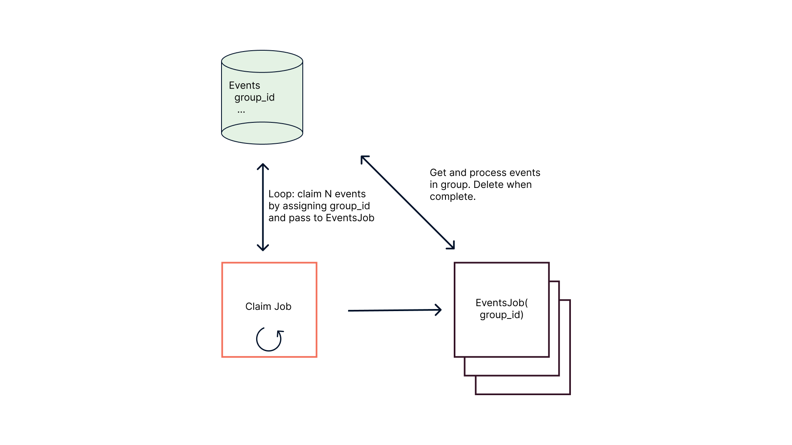
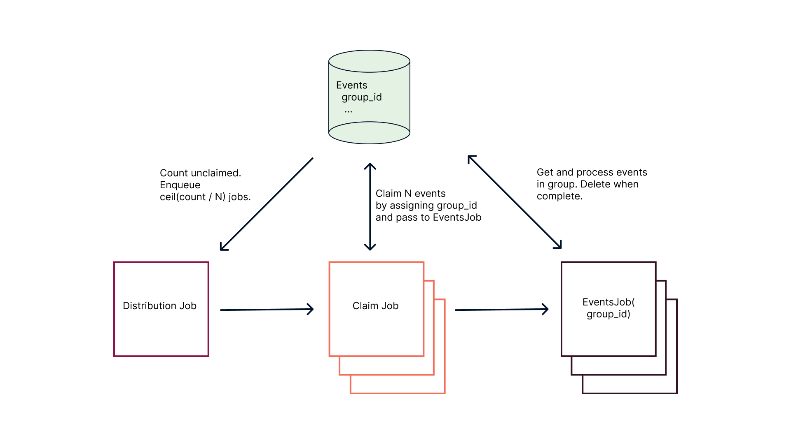

# Buffer Tables for Background Jobs

Here is a pattern I've seen several times, especially in applications that have a data-intensive integration with a third-party service.

Suppose we have the following method for recording that a sales `Lead` has been contacted.  We save this `ContactActivity` in our database, but we also use a third-party marketing service that needs to be apprised of this fact.  We accomplish this by enqueuing a background job that sends this update via REST API to that service. Something like this:

```ruby
class Lead < ApplicationRecord
  has_many :contact_activities

  def record_activity!(type:, comment:)
    ContactActivity.new(type:, comment:).tap do |activity|
      contact_activities << activity
      save!
      RecordMarketingActivityJob.perform_async(activity.id)
    end
  end
end
```

In general, it is a good idea to scope background jobs to small, single transactions.  Reasons include:

- It is easier to make them idempotent.
- Single job failures affect at most a single transaction.
- They are easier to reason about.
- They will generally complete quicker.  Long-running jobs are problematic.  They can delay deployments or risk being interrupted, potentially leaving data in an inconsistent state.

But what happens when we scale up our sales operation and start recording, say, 10s or 100s of thousands of contact activities per day?  We'll be enqueuing 100s of thousands of background jobs, each sending an API request to that marketing service.  We'll probably start hitting rate or concurrent connection limits for that API; job queues will back up; data sync latency will increase; marketers will complain.

Fortunately, the marketing service's API includes endpoints for bulk operations.  Instead of sending a single update per request, we can send, say, 1,000 per request.  This would cut down our job and request volume by a few orders of magnitude and make it easier to avoid the above issues.

We don't, however, want to restructure all of our code and APIs for recording contact activities to accommodate this background process.  Ideally, we would keep our existing single-record operations for recording contact activities, but take advantage of bulk operations for syncing these with the marketing service.  In other words, we want to keep the main operation decoupled from handling its side effect, since they have different reasons to change.

In this article, I'll describe one strategy for doing this.  We are going to keep it [boring](https://boringtechnology.club/) and use technologies that you are probably already using.  In particular, we'll assume we're using Postgres and Sidekiq as our job processor (using Redis).  But you could probably apply the same strategy using your preferred RDBMS and background job runner of choice.

## Buffer table

The basic idea is to have a database table dedicated to storing events that we want to process in batch background jobs.  At the point in our code where we would enqueue a single-record job, we instead insert into this table.  We will then have a scheduled job that polls this table every few minutes (or whatever time interval makes sense for our use-case) and dispatches batches of records to jobs to perform the target operation(s) in bulk.

The changes to our example method above will be small.  Instead of enqueuing a `RecordMarketingActivityJob` with the newly created `ContactActivity`'s ID, we create a `ContactActivityEvent` associated to the `ContactActivity`.  The table behind this model `contact_activity_events` will be our "buffer table" dedicated to batch processing.

```ruby
class Lead < ApplicationRecord
  has_many :contact_activities

  def record_activity!(type:, comment:)
    ContactActivity.new(type:, comment:).tap do |activity|
      activity.contact_activity_events << ContactActivityEvent.new
      contact_activities << activity
      save!
    end
  end
end
```

By using a database table, we get a few of benefits for free:

- *Transactions*: Enqueuing an event for background processing can now participate in a transaction with the main operation.  We can guarantee that, for example, either the contact activity was successfully created *and* an associated event was enqueued or neither operation completed.
- *Data integrity*: We can enforce familiar data integrity checks on our events.  We should have a foreign key constraint on our contact activity events table referencing our contact activities table to ensure that we don't have any orphaned events.  Also, for example, suppose we want to guarantee that we are only handling a single event per contact activity at a time.  We could add a unique constraint to the `contact_activity_id` column to enforce that.
- *Familiarity*: We can use the same tools (e.g., ActiveRecord) and patterns that we are already using to interact with the database.

One downside, however, especially when compared to an alternative implementation in, say, Redis, is that we could quickly run into performance issues with a naive implementation and a relatively high volume of events.  Assuming our buffer table is in our application database, performing updates and queries on this table could end up consuming database resources and slowing down other areas of our application.  Let's consider some strategies for avoiding this.

### Performance heuristics

The main performance heuristic is to keep the buffer table small and single-purpose.  Its purpose is to store and track events for batch processing.  Once a job has finished with an event, it should be deleted.  If you need to keep these events in your database for logging or reporting, copy them to another table (an "archive" or "completed" table) before deleting them in the same transaction.

We will be querying this table at least every few minutes or so.  Controlling the table size will make it easier to keep these queries fast.  But this workload will also be relatively write-heavy.  We will be inserting each event one at a time; these will be updated when they are assigned to a batch; and then they will be deleted.  Accordingly, we should not add indexes to the table that do not directly support these operations, since they would unnecessarily slow down writes.  Again, if you need to query these events for other purposes, use a separate table.

Also, after the initial event creation, we should avoid individual updates and deletes.  If our batch size is 1,000, we should update/delete a batch in a single database command instead of issuing 1,000 separate update/delete commands.  This will probably be faster since it requires fewer network round-trips and it reduces overall load on the database.

Finally, if possible, we should take advantage of our background job processor and run many batch jobs concurrently.  We can process more events in less time, i.e., increase throughput.  This also reduces the likelihood of the buffer table growing to an unwieldy size during periods of high volume, since we are processing and deleting them at a faster rate.  (Although, note that we will still need to stay within the rate limiting confines of the marketing service API.)

## Implementation

What does an implementation look like that follows these performance heuristics?

### Schema

The schema for the buffer table will be simple.  We will have the typical boilerplate (primary key, timestamp columns) and whatever application-specific columns we need.  In the present case, this would be a foreign key to `contact_activities`.  We will probably want an index on this column, since we will join this table upon selecting the `contact_activity_events` so that we have the requisite information to send to the marketing service.

The only batch processing specific column will be a nullable `uuid` column called `group_id`, which identifies the batch a record is a member of.  We will put a `BTREE` index on this column, since this will be our main query filter after events have been assigned to a group/batch.  To see how this schema facilitates following the performance heuristics above, let's look at the background jobs that will actually run the batch processing.

### Jobs

There will be two main phases.  In the first phase, events will be grouped or "claimed" by a job.  Claiming events consists of assigning them a `group_id` and enqueuing a job, call it `EventsJob`, to carry out the actual target operation(s) for the events in that group.  The `EventsJob` performs the second phase.  It takes a `group_id` as an argument and selects the events with that `group_id`, probably `JOIN`ing.  Then, it performs the target operation and deletes the events with the given `group_id`.  (That is, if the operation is successful.  We'll address failures and retries [later](#failures-and-retries).)

A simple implementation would have a scheduled `ClaimJob` that runs every few minutes and does the following

  1. Select `batch_size` number of IDs of unclaimed events (i.e., where `group_id` is `NULL`).
  2. Generate a `group_id` using `SecureRandom.uuid`.
  3. Issue a bulk update setting that `group_id` for those records.
  4. Enqueue an `EventsJob` with `group_id` as an argument.
  5. Repeat until either all events in the table are claimed or we reach some configured limit of number of batches per job.  This is to avoid very long-running jobs and/or overlap with the next scheduled job `ClaimJob`.



The main benefit of this approach is that it is straightforward.  It will probably work fine in cases where we have a consistent volume of events and where maximizing throughput is not a priority.  However, there are some tradeoffs.

The `ClaimJob` is not designed for concurrency.  This puts a potentially significant limit on how quickly we can claim events and enqueue `EventsJobs`, since we query for unclaimed events one at a time.  If we get a big spike in events such that these are being inserted at a faster rate than we are claiming them and we are limiting how many queries run per `ClaimJob`, the jobs will end before all events are claimed.  The claiming process can fall behind, growing the size of the events table and possibly slowing down queries.  It might take a while for these to catch up and claim all of the events after the spike subsides, delaying the target operation.

Also, we could end up with multiple `ClaimJob`s running concurrently, unless we take measures[^1] to prevent this.  There could be an unrelated backup of jobs in the same queue.  `ClaimJob`s would be enqueued on schedule, but if the backup is long enough, they would get stuck in the queue such that multiple `ClaimJob`s are enqueued before any one runs.  Once the backup subsides, they could get picked up by different worker threads and run concurrently.  This presents a problem if the queries for unclaimed events do not include any concurrency controls, like row-level locking.  Two `ClaimJob`s running concurrently could end up "claiming" the same events and overwriting each other's `group_id`s.  This could have unexpected results, like an `EventJob` running with a `group_id` that no longer exists.

To fix the potential concurrency issues with these queries, we can add the `FOR UPDATE SKIP LOCKED` phrase on our query for unclaimed events.  `FOR UPDATE` acquires a row-level lock on the batch of unclaimed records, which prevents another transaction (e.g., in a concurrent `ClaimJob`) from modifying that row until the current transaction ends.  `SKIP LOCKED` says what to do if this query encounters a row that already has a lock on it.  Namely, it skips it, behaving like the row doesn't exist for this query.  This is fine for our purposes, since we only care that the record is being claimed by some single `ClaimJob`.

Here's what our `ContactActivityEvent` and `ClaimContactActivityEventsJob` might look like with this modification:

```ruby
# app/models/contact_activity_event.rb
class ContactActivityEvent < ApplicationRecord
  belongs_to :contact_activities
  
  scope :unclaimed, -> { where(group_id: nil) }

  def self.claim(limit)
    raise ArgumentError, 'block required' unless block_given?

    transaction do
      ids = unclaimed.lock('FOR UPDATE SKIP LOCKED').limit(limit).pluck(:id)
      if ids.present?
        group_id = SecureRandom.uuid
        where(id: ids).update_all(group_id:)
        yield(group_id)
      end
      ids
    end
  end
end

# app/jobs/claim_contact_activity_events_job.rb
class ClaimContactActivityEventsJob
  include Sidekiq::Job

  def perform
    ContactActivityEvent.claim(Rails.configuration.buffer_batch_size) do |group_id|
      ContactActivityEventsJob.perform_async(group_id)
    end
  end
end
```



```ruby
# app/jobs/distribute_contact_activity_events_job.rb
class DistributeContactActivityEventsJob
  include Sidekiq::Job

  def perform
    batch_count = [(events_count / batch_size.to_f).ceil, max_batches].min
    args = batch_count.times.map { [] }
    ClaimContactActivityEventsJob.perform_bulk(args)
  end

  private

  def events_count
    ContactActivityEvent.unclaimed.count
  end

  def batch_size
    Rails.configuration.buffer_batch_size
  end

  def max_batches
    Rails.configuration.max_distribution_batches
  end
end
```

### Failures and retries

One of the nice things

### Code

TODO

[^1]: Examples of these include using a [rate limiter for Sidekiq](https://github.com/sidekiq/sidekiq/wiki/Ent-Rate-Limiting#concurrent) or running these jobs in a queue with only one worker thread.
