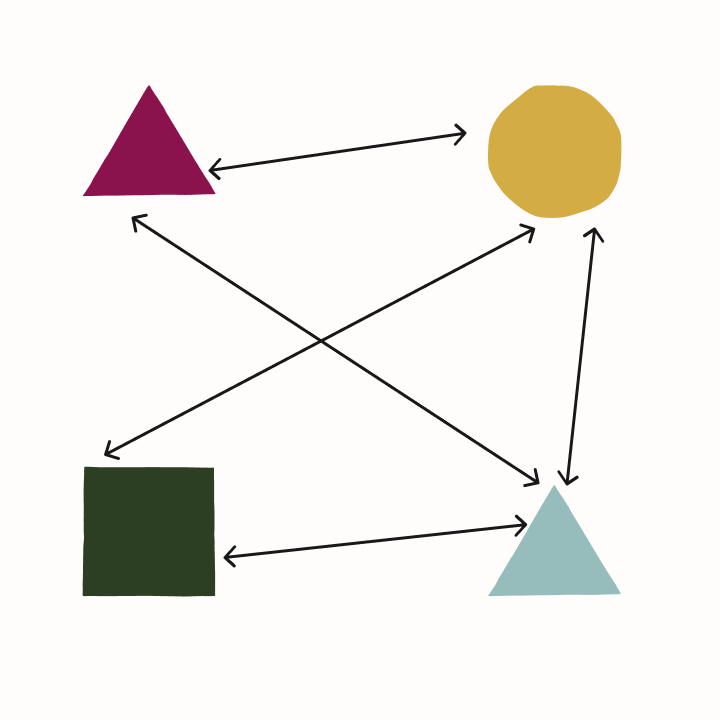
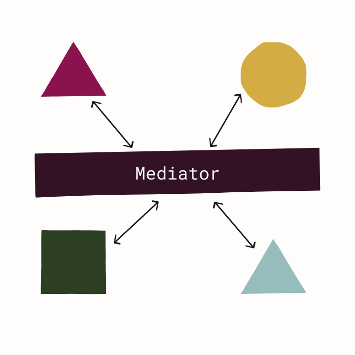

# Rails on Mediator Part 1: Mediator and Thin Controllers

Are you having trouble managing the complexity of your Ruby on Rails application?  Are your models tangled together and difficult to change?  Do your controllers contain a lot of complex logic making them difficult to understand and test?  In this 3-part series, I'll suggest some ways that using a mediator to organize parts of your application could help manage this complexity.  Read on to learn how to make your controllers thinner and decouple them from the rest of your application, how to [use domain events to decouple your models](../part-2-domain-events/article.md), and how to [implement cross-cutting concerns without adding more code to your controllers](../part-3-crosscutting-and-tradeoffs/article.md).

## The Pattern

The subject of this series is a pattern for organizing certain areas of an application.  It aims to reduce unnecessary coupling between components and encourage the use of single-responsibility classes, making them easier to change and test.  It also has the benefit of providing easy points of extension for implementing cross-cutting concerns, which we'll cover in [Part 3](../part-3-crosscutting-and-tradeoffs/article.md).  This pattern is relatively popular among C# developers, the [MediatR](https://github.com/jbogard/MediatR) package being the original and most popular implementation of it.  In this series, we'll look at how this could be applied to Rails applications using the [Mediate](https://github.com/rferg/mediate) gem.

### Caveats

Like any design pattern, there are trade-offs associated with using it (we'll discuss these in [Part 3](../part-3-crosscutting-and-tradeoffs/article.md) as well).  There is additional overhead in setting it up, more boilerplate to write, and a few things to learn in order to use it effectively.  For relatively simple CRUD apps, the benefits do not outweigh the costs; Rails already handles these types of apps quite well.  On the other hand, as the dependency relationships between your controllers, models, and services become more chaotic and complex, the benefits start to outweigh the costs.  This is especially true if your code changes frequently.  The decoupling that this pattern imposes on your code makes managing change easier.

There is [some controversy](https://jimmybogard.com/you-probably-dont-need-to-worry-about-mediatr/) about what to call this pattern.  MediatR is named after the [Mediator Pattern](https://refactoring.guru/design-patterns/mediator), because it shares some similarities and is meant to solve a similar problem: chaotic dependencies.  But it may be closer to the [Command Dispatcher Pattern](https://hillside.net/plop/plop2001/accepted_submissions/PLoP2001/bdupireandebfernandez0/PLoP2001_bdupireandebfernandez0_1.pdf).  Despite that, I'll continue referring to the main object in question as a 'mediator', since it follows existing usage of the term and it's an adequate enough description.

### The Mediator Pattern

The purpose of the Mediator Pattern is to improve a situation like the following.  You have a number of components that directly interact with each other.  These might be a group of classes that directly call methods on each other.  Consequently, each component directly depends on and is coupled to multiple other components.  It's difficult to understand how data flows through this system.  It's also difficult to change, reuse, or test any of these components.



Instead of having each component directly interacting with others, we could have all interactions between them be mediated by a central component.  Now each component only has one dependency, the mediator.  This mediator would have a single public method, e.g., `dispatch`, that a component would call, passing in a request object or message.  The mediator would then be responsible for calling the correct method on the correct class and returning the result to the original caller of `dispatch`.  In effect, we've encapsulated the logic of how these components interact into a central place, instead of having it spread across multiple places in a haphazard way.  We've also greatly reduced the number of dependencies that each component has.



This is fine if we limit the scope of our mediator to a particular domain and the number of interacting components is not too large.  We might have a straightforward implementation like the following.

```ruby
class SampleMediator
  def initialize(component_a, component_b, component_c)
    @a, @b, @c = component_a, component_b, component_c
  end

  def dispatch(request)
    if request.type == :a
      @a.do_something(request.params)
    elsif request.type == :b
      @b.do_another_thing(request.params)
    # etc...
    else
      raise 'Invalid message'
    end
  end
end
```

However, this can obviously get out of hand as the number of components grows.  Our mediator can start to become a God class; it has to know directly about all the components and what methods to call on them.  This is not a suitable implementation if we want to use this for organizing component interactions throughout an application.

### Generalizing the Mediator

In the implementation above, the mediator has references to each component class and calls whatever the appropriate method on one of those classes happens to be for a given request.  Instead, we can force handlers of requests to implement a common interface, e.g., a single `handle` method.  Additionally, we transfer to the handler the responsibility of declaring what types of requests it handles and registering this with the mediator.  The mediator, then, turns into a glorified lookup table, resolving request handlers dynamically at runtime.  When `dispatch` is called with a request, it looks up the correct handler for that type in its handler registrations, then it instantiates the handler and calls its `handle` method, passing in the request and returning the result to the caller of `dispatch`.  Adding additional request handlers no longer increases the complexity or difficulty maintaining the mediator because they are resolved in a completely general way.

We can also think of the mediator as kind of like an in-process message bus--a simple pipe that routes requests to handlers.  With this in mind, a couple of additional features follow quite easily.  So far we've been describing a request-response flow: a request has a single handler that returns a response to the caller.  But we can also have multiple handlers; we can publish notifications or events to the mediator, which sends these to registered handlers, but doesn't return anything to the caller (the [Mediate gem has support for these](https://github.com/rferg/mediate#notifications)).  We can also support [pre- and post-request handler decorators or behaviors](https://github.com/rferg/mediate#pre--and-post-request-behaviors).  These can be registered with the mediator to run code before or after the request handler for certain types of requests, almost like middleware in the request processing pipeline.  (Notifications and request handler decorators will come up again in Parts [2](../part-2-domain-events/article.md) and [3](../part-3-crosscutting-and-tradeoffs/article.md) of this series.)

So what does this code look like?  For the Mediate gem, a request is just a class that inherits from `Mediate::Request`.  We can add whatever attributes or methods we like.

```ruby
class MyRequest < Mediate::Request
  attr_reader :message

  def initialize(message)
    @message = message
    super()
  end
end
```

A request handler inherits from `Mediate::RequestHandler`.  It must implement a `handle` method, which takes the request as an argument.  To register the class of requests it handles, it calls the `handles` method.  A handler will also receive a request that is a subclass of the registered request class unless another handler registers that particular subclass (see [here](https://github.com/rferg/mediate#request-polymorphism)).

```ruby
class MyRequestHandler < Mediate::RequestHandler
  handles MyRequest

  def handle(request)
    "Received: #{request.message}"
  end
end
```

For simple handlers, creating an entire handler class is a lot of boilerplate.  Mediate also [provides the ability](https://github.com/rferg/mediate#implicit-handler-declaration) to create a handler for a request by simply passing a lambda to `Mediate::Request.handle_with`.

```ruby
class MyRequest < Mediate::Request
  # same as above...
  handle_with ->(request) { "Received: #{request.message}" }
end
```

Now that we have requests and handlers defined, we can use them by simply creating a request and passing it to `Mediate.dispatch`.  It will find the correct handler according to the request's class and return the result of its `handle` method.  If it cannot find a handler, it will throw an error.

```ruby
request = MyRequest.new('hello')
response = Mediate.dispatch(request)
puts response # 'Received: hello'
```

Note that the above code knows nothing about `MyRequestHandler` or how it's implemented.  It dispatches requests through the mediator and gets a response without knowing anything about how that response was generated.  This gives us a lot of latitude to make changes to the request handler code without having to change any of the code responsible for dispatching the requests.

## Thin, Decoupled Controllers

### Problems with Thick Controllers

In a typical, Model-View-Controller Rails application, controllers end up being responsible for many things.  Not only do they parse and validate parameters from HTTP requests and return responses, they are also often responsible for a lot of what happens in the middle.  In relatively complex applications, this can include calling multiple methods on one or more models and often involves one or more control flow branches (i.e., if statements).

This is code that you probably want to unit test.  Because there are multiple control flow branches, there are probably quite a few test cases that you will want to run through to make sure every branch is exercised.  Properly isolated unit tests are generally faster than integration tests; if we are going to run a lot of tests, we would prefer them to be faster.  Also, unit tests are more precise.  Since they run smaller units of application code, when a test fails it is easier to identify the cause of the failure.  This becomes more useful as the complexity of your code increases and sources of bugs become more difficult to identify.

However, if this complex "code in the middle" is in a controller action, unit testing it in Rails is effectively impossible; you have to write some sort of integration test: a controller or request test.  This means exercising the object under test through a comparatively cumbersome interface of URLs, params, and hashes.  Despite the Rails helper methods, calling methods on plain Ruby objects would be more straightforward.  Moreover, controllers provide limited options for handling dependencies that we may want to mock or stub in our tests.  We cannot pass a stub through a constructor or method argument like we could with a plain Ruby class.  In practice, we end up using a gem, like rspec-mocks, to intercept calls to the specific classes and methods used in the controller, which leaks implementation details to our tests.

TODO

### Using Request Handlers

TODO

### An Example: Creating a Post

TODO

### Alternatives

TODO

## Conclusion
