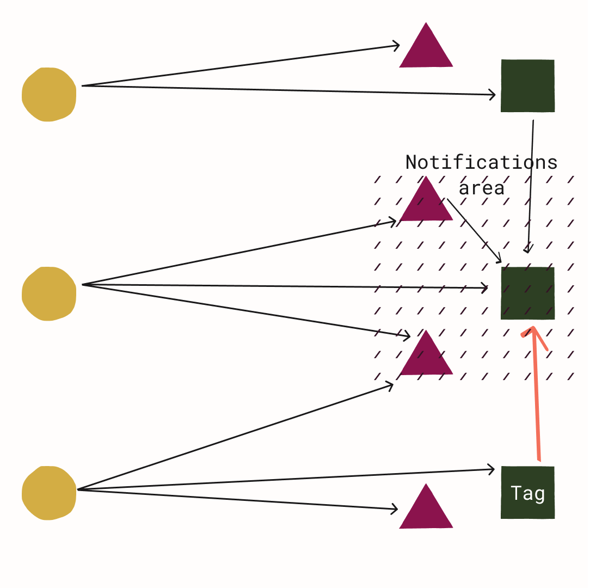
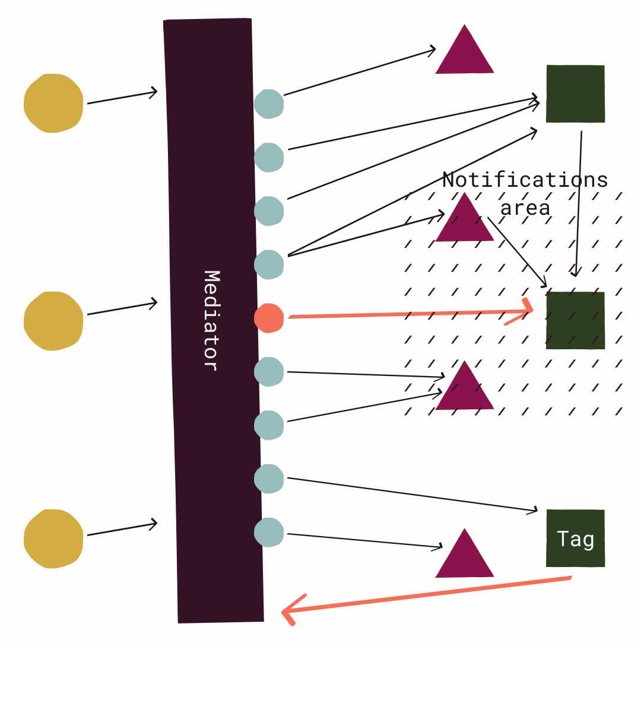

# Rails on Mediator Part 2: Domain Events

Are you having trouble managing the complexity of your Ruby on Rails application?  Are your models tangled together and difficult to change?  Do your controllers contain a lot of complex logic making them difficult to understand and test?  In this 3-part series, I'll suggest some ways that using a mediator to organize parts of your application could help manage this complexity.  Be sure to read [Part 1](../part-1-intro-and-controllers/article.md) where I introduced the mediator pattern and showed how you can use it to make your controllers thinner.  In this part we'll look at how to use domain events to decouple your models. Stay tuned for [Part 3](../part-3-crosscutting-and-tradeoffs/article.md) to learn how to implement cross-cutting concerns without adding more code to your controllers.

## Domain Events

A [domain event](https://learn.microsoft.com/en-us/dotnet/architecture/microservices/microservice-ddd-cqrs-patterns/domain-events-design-implementation) is something that happened within an application domain (e.g., "post created") that we want other areas of the application to act upon, performing some side effect.  This is a pattern associated with Domain-Driven Design, but it is still useful even if we are not strictly adhering to DDD.  The idea is to make these events and side effects explicit by creating event and event handler classes, e.g., `PostCreated` and `PostCreatedHandler`.  After the event occurs, the event class is instantiated and dispatched to something (e.g., a mediator) that can find the appropriate handler and pass the event to it.  The handler then carries out the desired side effect, decoupled from the code that originally created the event.  All of this usually happens synchronously and within the same process and transaction, so that if any part of it fails, everything can be rolled back.

This is in contrast to what is typically called an [integration event](https://learn.microsoft.com/en-us/dotnet/architecture/microservices/microservice-ddd-cqrs-patterns/domain-events-design-implementation#domain-events-versus-integration-events), where the handler runs asynchronously after the original database transaction was committed.  Integration events are often transmitted over some kind of message broker to another process or application.

## An Example: Notifying Followers

Suppose we have a forum application.  Users can create posts and tag them to indicate what they're about (e.g., #unpasteurized_cheese).  Users can also follow tags that they're interested in.  When a tag is applied to a post, its followers should be notified.

Since the relation between posts and tags is many-to-many (a post can have zero or more tags and a tag can be applied to zero or more posts), we'll have a join model, `PostTag`, relating the `Post` and `Tag` models.  Applying a tag to a post, then, is just creating a `PostTag` record with the appropriate associations.

But our requirements also dictate that we need to notify followers of a `Tag` when it's applied.  This is a desired side effect of the main operation: creating a `PostTag`.  To carry out this side effect, we'll need to invoke other parts of our application that are responsible for user notifications.

For simplicity, let's assume that creating a `Notification` record is sufficient for notifying a user.  To implement this, one might initially write a `Tag#apply_to` method like the following:

```ruby
class Tag < ApplicationRecord
  has_many :post_tags
  has_many :posts, through: :post_tags
  has_many :tag_follows

  def apply_to(post)
    Tag.transaction do
      post_tags.create(post:)
      follower_ids = tag_follows.pluck(:user_id)
      if follower_ids.present?
        notifications = follower_ids.map { |user_id| { user_id:, content: "Posted: '#{post.title}'!" } }
        Notification.insert_all(notifications)
      end
    end
  end 
end
```

This, however, has a number of drawbacks.  We've added some additional responsibilities to our `Tag` model.  It is now responsible for generating the content of a notification when a post is tagged (`"Posted: '#{post.title}"`) and for creating `Notification` records with the correct attributes.  These responsibilities seem orthogonal to the model's intended purpose of representing a post tag.  Our `Tag` class is now more complex, harder to test, and harder to change.  This could be improved by encapsulating that logic within its own class or within the `Notification` model, so that, say, `apply_to` only has to call `Notification.post_tagged(post, tag)` after it creates the `PostTag` record.  However, this does not help with two other issues.

First, it's not obvious from looking at the `apply_to` method what is the main operation and what are the side effects, if any.  Is creating these `Notification` records essential to the operation of a `Tag` or `PostTag` as dictated by some business rule?  Or is it just in service of supporting some other part of the application?  It's difficult to tell by only looking at this method without context.

Second, this method directly couples two parts of our application that have distinct responsibilities (post and tags vs. notifications).  Now, when testing the `Tag` model, we have to consider this call to method(s) on `Notification` and verify it.  We might have to mock it if, for example, `Notification.post_tagged` does things that we don't want running in our tests (e.g., make a network call to a third-party service).  Also, since `Tag` depends on `Notification`, if `Notification` changes, we might have to make changes to `Tag#apply_to` as well.



## Implementing Domain Events in Rails with a Mediator

Domain events can solve these issues by putting the notification logic in an event handler that's decoupled from `Tag`.  The `apply_to` method, then, would only be responsible for making sure a `PostTagged` event is dispatched when it creates the `PostTag` record.  It will end up looking like the following.  Note that we've removed any reference to `Notification`.

```ruby
class Tag < ApplicationRecord
# ...
  def apply_to(post)
    add_domain_event(Events::PostTagged.new(post, tag))
    post_tags.create(post:)
  end
end
```



How does this work?  We will want all of our models to have the ability to dispatch domain events.  So we'll have `add_domain_event` as a method on the base class `ApplicationRecord`.  This method adds events to an internal array, which will be exposed via another public method `domain_events`.  Then we'll add an `after_save` callback on `ApplicationRecord` that gets these `domain_events` and publishes them to the mediator, which will in turn send them to the appropriate handlers.  Domain events will be published as `Mediate::Notification`s.  Recall from [Part 1](../part-1-intro-and-controllers/article.md) that notifications can have multiple handlers and do not return anything to the notification publisher.  We choose the `after_save` callback (instead of `after_commit`) because we want any additional database writes made by the event handlers to be part of the same transaction as the originating operation.

That's the overview, now let's look at the details.  First, we'll create a base class for events that inherits from `Mediate::Notification` and has a `published` attribute.

```ruby
module Events
  class ApplicationEvent < Mediate::Notification
    attr_accessor :published
  end
end
```

Next, let's add our methods and callback to `ApplicationRecord`.

```ruby
class ApplicationRecord < ActiveRecord::Base
  after_save ::Events::PublishCallbacks.new

  def add_domain_event(event)
    internal_events << event
  end

  def domain_events
    internal_events.clone
  end

  private

  def internal_events
    @internal_events ||= []
  end
end
```

`domain_events` returns a clone of the internal events array because we want to encapsulate mutations of it; we only want to allow additions through the `add_domain_event` method.  We've separated the code for the `after_save` callback into its own class using a [callback class](https://guides.rubyonrails.org/active_record_callbacks.html#callback-classes).  This is where we publish events to the mediator from whatever model was saved.  It looks like this:

```ruby
module Events
  class PublishCallbacks
    def initialize(publisher = Mediate.mediator)
      @publisher = publisher
    end

    def after_save(model)
      loop do
        next_event = model.domain_events.find { |e| !e.published }
        break unless next_event.present?
        next_event.published = true
        @publisher.publish(next_event)
      end
    end
  end
end
```

With each loop in the `after_save` method, we get the first unpublished event on the model, set `published` to `true`, and publish it to the mediator.  We break out of the loop when there are no more published events.  We do this one event at a time and re-evaluate `model.domain_events` on each loop because it's possible that one of the event handlers added more events to the model in question.  Iterating over the events once and publishing each of them would miss those events.

That completes our `ApplicationRecord` setup.  Now, any model is capable of publishing events.  All that remains is to define our `PostTagged` event and the handler for it.  `PostTagged` is simple enough; it inherits from `ApplicationEvent` and has attributes for a `Post` and a `Tag` whose values are passed through the constructor.

```ruby
module Events
  class PostTagged < ApplicationEvent
    attr_reader :post, :tag

    def initialize(post, tag)
      @post = post
      @tag = tag
    end
  end
end
```

The handler inherits from `Mediate::NotificationHandler` and has a single `handle` method that takes in the event.  This is where we put the code that creates the notifications.  Note that we call `handles Events::PostTagged` to register this with the mediator.

```ruby
class PostTaggedHandler < Mediate::NotificationHandler
  handles Events::PostTagged

  def handle(event)
    follower_ids = event.tag.tag_follows.pluck(:user_id)
    if follower_ids.present?
      notifications = follower_ids.map { |user_id| { user_id:, content: "Posted: '#{event.post.title}'!" } }
      Notification.insert_all(notifications)
    end
  end
end
```

And that's it!  We've removed the direct dependency on `Notification` from `Tag` and made this side effect explicit.  We can now change the behavior of this event side effect without touching the `Tag` class.  Additionally, if we wanted more things to happen when `PostTagged` fires, we can easily add more handlers for this event, since events are `Mediate::Notification`s, which can have multiple handlers.  Another nice effect of this decoupling is that we can also test `Tag` and `PostTaggedHandler` in isolation, making our tests more focused and easier to maintain.

In the [next and final part of this series](../part-3-crosscutting-and-tradeoffs/article.md) we'll look at how using a mediator can help improve implementations of cross-cutting concerns, like logging or authorization.  We'll also consider some of the general trade-offs of using a mediator to organize Rails applications.
