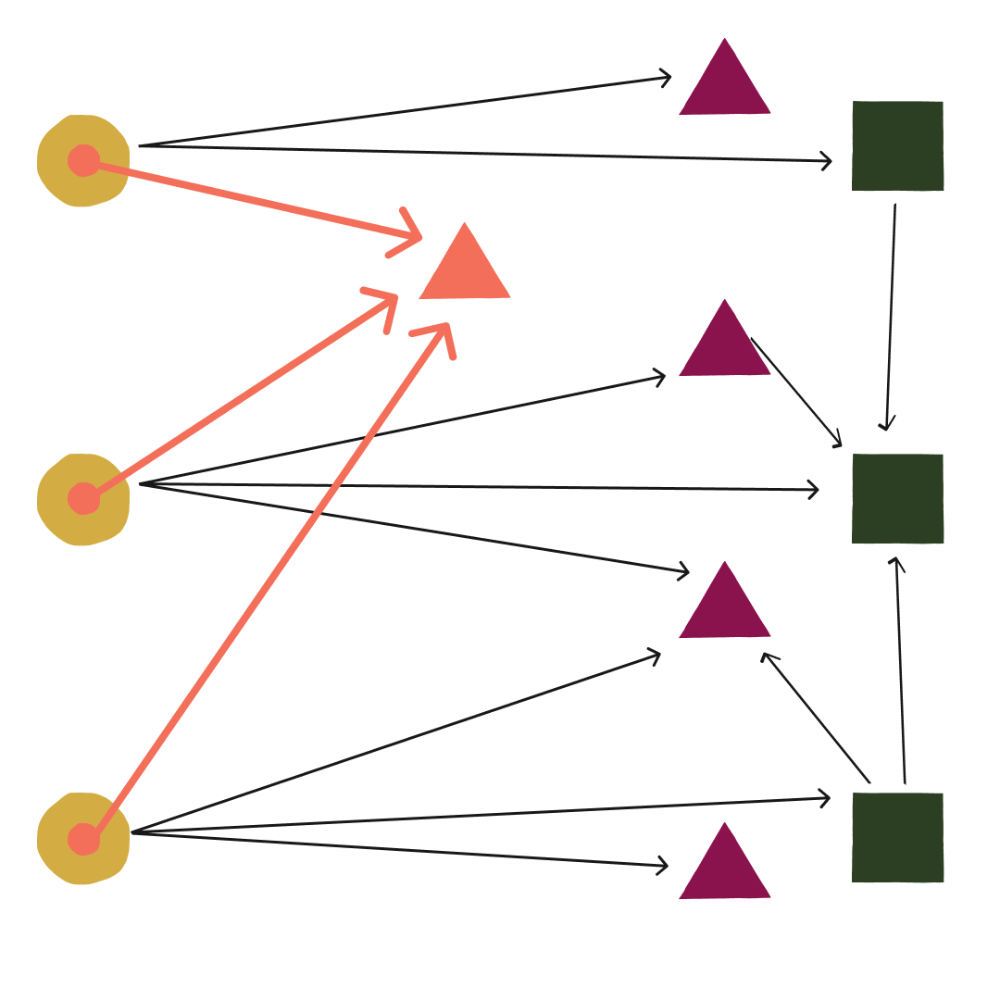
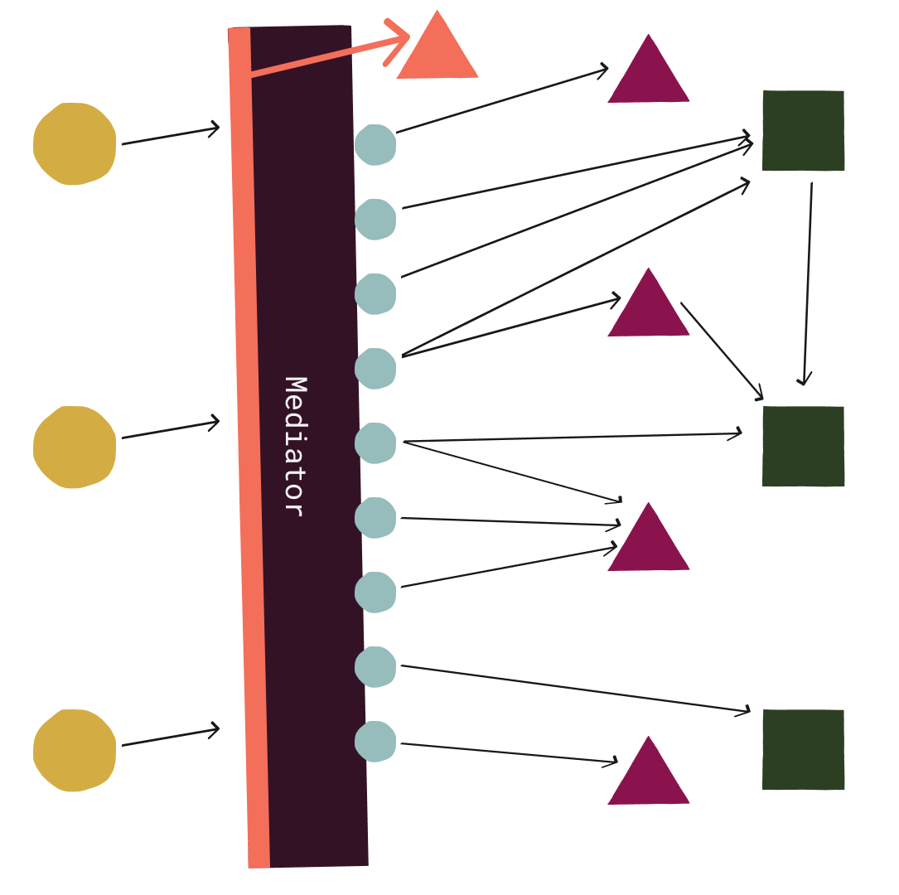

# Rails on Mediator Part 3: Cross-cutting Concerns and Tradeoffs

Are you having trouble managing the complexity of your Ruby on Rails application?  Are your models tangled together and difficult to change?  Do your controllers contain a lot of complex logic making them difficult to understand and test?  In this 3-part series, I'll suggest some ways that using a mediator to organize parts of your application could help manage this complexity.  Be sure to read [Part 1](../part-1-intro-and-controllers/article.md) where I introduced the mediator pattern and showed how you can use it to make your controllers thinner.  In [Part 2](../part-2-domain-events/article.md) I discussed decoupling your models with domain events. In this final part, we'll learn how to implement cross-cutting concerns without adding more code to your controllers.  We'll also consider some of the general trade-offs of using a mediator to organize Rails applications.

## Cross-cutting concerns

Cross-cutting concerns are parts of an application that are used across feature modules.  Examples include logging, caching, transaction management, and authorization.  For many of these, adding them to a Rails application involves some combination of including modules or adding methods on controllers or models.  We might even include modules on `ApplicationController` or `ApplicationRecord` or some other base class to make them widely available.  This introduces additional dependencies, can clutter these classes with methods, and can complicate testing.



With a mediator, on the other hand, we have a nice way of handling cross-cutting concerns.  Recall from [Part 1](../part-1-intro-and-controllers/article.md) that Mediate allows for [pre- and post-request handler behaviors](https://github.com/rferg/mediate#pre--and-post-request-behaviors).  These are behaviors that we can slot into the request processing pipeline before or after the request handler runs.  Like request handlers, we can register these for a particular request class and these registrations will also apply to any subclasses of that request class.  Therefore we can add behavior that can run on all requests or on a certain broad type of requests.  This allows us cut across feature modules without having to modify any controllers or methods.  Moreover, these behaviors will (or should be) single-responsibility, plain Ruby classes that we can easily test.



Let's consider authorization as an example and see how mediator can help us improve the standard way that it's done in Rails.

### An Example: Authorization

We're going to use the [Pundit gem](https://github.com/varvet/pundit) to help us with authorization and we'll consider a single operation: creating a post.  Our rule is that a user can create a post as long as they're not banned.  The policy class will look like this:

```ruby
class PostPolicy < ApplicationPolicy
  def create?
    !user.banned?
  end
end
```

We include the `Pundit::Authorization` module in our `ApplicationController` which gives us access to the `authorize` method in our controllers.

```ruby
class ApplicationController < ActionController::Base
  include Pundit::Authorization
end
```

Within our controller method, we call `authorize` with a model instance, a model class, or symbol.  Based on that, Pundit finds the correct policy class.  Pundit infers based on the controller action name, `create`, that it should call the `create?` method on that class.  If that returns false, it throws an exception.

```ruby
class PostsController < ApplicationController
  # ...
  def create
    authorize Post
    # ...
  end
end
```

Note a couple of things about including this in our controller.  First, we've added another responsibility to our controllers.  Second, `authorize` has to be called explicitly in each controller action we want to authorize, which is probably almost all of them.  Adding this `authorize` call is easy to forget.  Pundit even [provides helper methods](https://github.com/varvet/pundit#ensuring-policies-and-scopes-are-used) in its `Authorization` module that will throw an exception if `authorize` is not called.

```ruby
class ApplicationController < ActionController::Base
  include Pundit::Authorization
  after_action :verify_authorized # code smell?
end
```

This `verify_authorized` method helps developers.  But the fact that we had to add this compensatory measure may indicate that our design is not ideal.  We're not making the correct thing to do as easy as it could be.  Can a mediator help us do better?  If we register a pre-handler authorization behavior for the base class of all requests, it will automatically run on every request that gets dispatched to the mediator.  Thus, we can authorize each request without having to modify any controllers and without having to remember to call `authorize`.

How do we implement this?  First, we have our request base class, `ApplicationRequest`, and we're going to add a few methods to it.  By default, these will return `nil`, but they can be overridden to return something else.  These will be used for resolving the authorization policy class and method that should be used.  When these return values, we'll use those, otherwise, we'll make an inference based on conventions.

```ruby
class ApplicationRequest < Mediate::Request
  # ...
  def authorization_object; end

  def authorization_method; end

  def authorization_policy_class; end
end
```

Pundit has a `Pundit::PolicyFinder` class for inferring a policy based on a model.  We can make use of that ourselves whenever the request returns something from `authorization_object`.  Otherwise, we'll use the module name of the request class, since we have a convention that these should be named like `PluralizedModel::Operation` (e.g., `Posts::Create`).  For the method, we'll use `authorization_method` or the name of the request class; that is, `Posts::Create` will use `create?`.  Our `AuthorizationBehavior` and `PolicyFinder` implementations are below.  The details of how we resolve the authorization policy are not that important.  What is important is that we can pretty easily do something similar to what the `Pundit::Authorization` module does, but we can do it outside of a controller and have it run on each request automatically.

```ruby
class AuthorizationBehavior < Mediate::PrerequestBehavior
  handles ApplicationRequest

  def initialize(policy_finder_class = PolicyFinder)
    @policy_finder_class = policy_finder_class
  end

  def handle(request)
    policy = policy_class(request).new(request.context.user, request.authorization_object)
    method = policy_method(request)
    policy.send(method)
  end

  private

  def policy_class(request)
    auth_object = request.authorization_object
    finder = @policy_finder_class.create(auth_object, request)
    finder.policy or raise "No auth policy for #{auth_object.inspect} or #{request.class}"
  end

  def policy_method(request)
    request.authorization_method || "#{request.class.name.demodulize.parameterize.underscore}?".to_sym
  end
end

class PolicyFinder
  def self.create(record, by_module_object = nil)
    PolicyFinder.new(record, by_module_object)
  end

  def initialize(record, by_module_object = nil, finder_by_record = Pundit::PolicyFinder)
    @finder_by_record = finder_by_record.new(record)
    @by_module_object = by_module_object
  end

  def policy
    @finder_by_record.policy || find_by_module
  end

  private

  def find_by_module
    return nil unless @by_module_object.present?

    record_name = @by_module_object.class.to_s.split('::').first.singularize
    "#{record_name}Policy".safe_constantize
  end
end
```

Consequently, we've relieved controllers of their authorization responsibilities and we can remove that Pundit code from them.

```ruby
class ApplicationController < ActionController::Base
  # removed: include Pundit::Authorization
  # removed: after_action :verify_authorized
end

class PostsController < ApplicationController
  def create
    # removed: authorize Post
    request = Posts::Create.new(
      post_params,
      auto_tag: params[:auto_tag]
    )
    result = send_request(request)
    # ...
  end
end
```

## Trade-offs and Alternatives

TODO

## Conclusion

TODO
